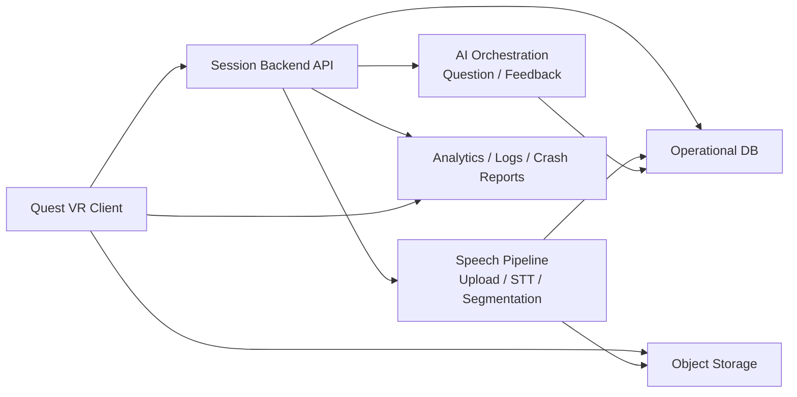
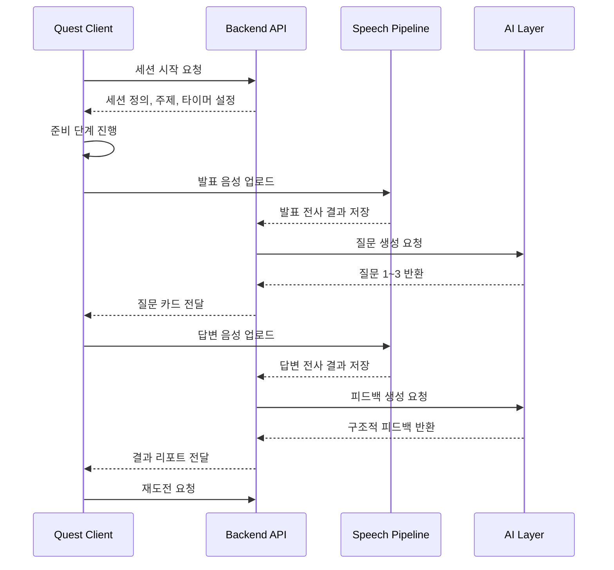

# Agora VR MVP Architecture

- 문서 버전: v0.2
- 작성일: 2026-03-30
- 상태: Draft
- 연관 문서: [PRD](./PRD.md), [AgoraPlan](./AgoraPlan.md)

## 1. 목적

이 문서는 Agora VR MVP의 시스템 아키텍처를 정의한다.

MVP의 핵심 목표는 다음과 같다.

- Quest 기반 단일 사용자 VR 세션을 안정적으로 실행한다.
- 사용자의 발표 음성을 수집하고, 세션 단계별로 의미 있는 텍스트 전사를 만든다.
- 전사 결과를 바탕으로 AI 질문 2~3개와 구조적 피드백을 생성한다.
- 청중 NPC와 공간 연출을 통해 "사람들 앞에 선 감각"을 구현한다.
- 한 세션이 짧고 반복 가능하도록, 재도전에 유리한 구조를 만든다.

## 2. 아키텍처 원칙

- MVP는 다인 멀티플레이보다 싱글 유저 세션 완성도를 우선한다.
- VR 클라이언트는 몰입감과 세션 진행에 집중하고, AI 연산은 백엔드에서 처리한다.
- 음성 원본, 전사 텍스트, 피드백 리포트는 서로 다른 수명 주기를 가진 데이터로 분리한다.
- 청중의 존재감은 룰 기반 연출이 우선이고, 생성형 AI는 질문과 피드백에 집중한다.
- 세션은 네트워크 불안정 시에도 완전히 중단되지 않도록 단계별 폴백을 가져야 한다.
- 이후 다인 토론 모드로 확장할 수 있도록 도메인 모델은 일반화하되, MVP 구현은 단순하게 유지한다.

## 3. 시스템 범위

MVP 시스템은 크게 5개 영역으로 구성된다.

- VR Client App
- Session Backend API
- Speech and Transcript Pipeline
- AI Orchestration Layer
- Analytics and Operations

## 4. 고수준 구성

## 5. 사용자 세션 관점의 전체 흐름

## 6. 주요 서브시스템

### 6.1 VR Client App

역할:

- 앱 부팅, 인증, 세션 진입
- 허브 아고라, 연단, 피드백 공간 렌더링
- 준비, 발표, 질문, 답변, 결과 단계 UI 제어
- 마이크 입력 수집과 음성 업로드
- 청중 NPC 연출과 카메라/조명/사운드 트리거 제어
- 세션 상태 저장과 재도전 UX 제공

권장 모듈:

- App Bootstrap
- Authentication
- Session Flow Controller
- Stage Presentation
- Audience NPC Director
- Voice Capture
- Upload Queue
- Feedback View
- Local Persistence
- Telemetry

### 6.2 Session Backend API

역할:

- 사용자 인증과 세션 생성
- 주제, 난이도, 타이머, 질문 수 등 세션 설정 반환
- 전사 결과와 AI 결과를 세션 단위로 관리
- 세션 단계 전환과 결과 조회 API 제공
- 재도전 세션 생성과 이전 시도 연결

핵심 책임:

- 클라이언트는 세션 흐름을 실행하지만, 세션의 공식 상태는 백엔드가 기록한다.
- 세션 리포트는 백엔드에서 조합해 반환한다.
- 질문 생성과 피드백 생성 요청의 추적 ID를 남긴다.

### 6.3 Speech and Transcript Pipeline

역할:

- 발표와 답변 음성 파일 수집
- 음성 구간 단위 저장
- STT 실행
- 발표 구간, 질문 답변 구간별 텍스트 정리
- AI 입력에 적합한 세션 transcript 생성

원칙:

- 원본 음성 파일과 정제 transcript는 분리 저장한다.
- 장기 저장이 불필요한 원본 음성은 짧은 TTL 정책을 둘 수 있다.
- transcript는 세션 분석과 품질 개선을 위해 구조화된 형태로 보관한다.

### 6.4 AI Orchestration Layer

역할:

- 질문 생성 프롬프트 구성
- 피드백 생성 프롬프트 구성
- 결과 스키마 검증
- 실패 시 재시도 또는 폴백 응답 생성

권장 하위 기능:

- Question Generator
- Feedback Analyzer
- Prompt Template Manager
- Output Validator
- Safety Filter

### 6.5 Analytics and Operations

역할:

- 세션 시작/완료/재도전 이벤트 수집
- 음성 업로드 실패, 전사 실패, AI 실패 모니터링
- 클라이언트 크래시와 성능 로그 수집
- 콘텐츠별 완주율과 재도전율 분석

## 7. MVP 권장 기술 방향

### VR 클라이언트

- Unity
- OpenXR
- XR Interaction Toolkit
- Input System
- Meta XR/Platform SDK

### 백엔드

- REST API
- 세션 메타데이터 저장용 관계형 데이터베이스
- 음성 파일 저장용 오브젝트 스토리지
- 비동기 작업 처리를 위한 job queue

### 음성 및 AI

- Speech-to-Text 서비스 또는 자체 추론 서버
- 질문/피드백 생성을 위한 LLM API
- 응답 스키마 검증을 위한 서버 측 파서

기술 선택 원칙:

- MVP에서는 특정 벤더 종속 최적화보다 개발 속도와 관측 가능성을 우선한다.
- 전사와 LLM은 교체 가능하도록 어댑터 계층을 둔다.

## 8. 클라이언트 아키텍처

### 권장 씬 구조

- Bootstrap Scene
- Agora Hub Scene
- Rehearsal Stage Scene
- Feedback Review Scene

### 권장 런타임 계층

- Platform Layer
- Session Layer
- Audio Layer
- World Layer
- UI Layer

### Platform Layer

- Quest entitlement check
- 로그인 토큰 저장
- 디바이스 상태 확인
- 앱 lifecycle 처리

### Session Layer

- 현재 세션 상태 머신 관리
- 타이머, 단계 전환, 재도전 파라미터 유지
- 백엔드 API 호출과 응답 반영

### Audio Layer

- 마이크 입력 시작/중지
- 음성 버퍼링
- 업로드 재시도
- 업로드 완료 이벤트 발행

### World Layer

- 연단 연출
- 청중 NPC 시선/반응 연출
- 조명, 주변음, 무대 효과 제어

### UI Layer

- 주제 카드
- 타이머 HUD
- 질문 패널
- 피드백 카드
- 재도전 CTA

## 9. 세션 상태 머신

MVP 세션은 다음 상태를 가진다.

1. Idle
- 허브 또는 진입 화면 상태

2. TopicReady
- 주제와 난이도를 확인하는 상태

3. Preparation
- 준비 타이머가 동작하는 상태

4. PresentationRecording
- 발표 음성을 녹음하고 업로드 준비를 하는 상태

5. QuestionLoading
- 질문 생성 결과를 기다리는 상태

6. AnswerRecording
- 질문별 답변 음성을 수집하는 상태

7. FeedbackLoading
- 피드백 생성을 기다리는 상태

8. FeedbackReview
- 강점, 개선 포인트, 재도전 CTA를 확인하는 상태

9. RetryBootstrap
- 같은 주제 재도전을 위한 초기화 상태

설계 원칙:

- 상태 전환은 명시적이어야 한다.
- 각 상태는 타임아웃과 오류 UI를 가져야 한다.
- 세션 재개가 어렵다면 최소한 안전 종료와 재시작을 보장해야 한다.

## 10. 음성 수집 및 전사 파이프라인

### 기본 흐름

1. 클라이언트가 발표 구간 음성을 로컬 버퍼에 기록한다.
2. 발표 종료 시 파일 단위로 인코딩한다.
3. 업로드 API를 통해 오브젝트 스토리지 또는 임시 업로드 엔드포인트로 전송한다.
4. 백엔드는 STT 작업을 enqueue한다.
5. STT 완료 후 transcript와 구간 메타데이터를 세션에 연결한다.

### 데이터 단위

- `session_id`
- `attempt_id`
- `segment_type`
  - `presentation`
  - `answer_1`
  - `answer_2`
  - `answer_3`
- `audio_url`
- `transcript_text`
- `duration_ms`
- `stt_status`

### 폴백 전략

- 업로드 실패 시 로컬 재시도 큐 유지
- STT 지연 시 "질문 생성 중" 대기 UI 제공
- STT 실패 시 규칙 기반 일반 질문 세트로 폴백 가능

## 11. 질문 생성 아키텍처

입력:

- 주제
- 난이도
- 발표 transcript
- 이전 질문 목록

출력:

- 질문 텍스트
- 질문 유형
- 질문 의도

질문 생성 규칙:

- 질문은 발표 내용에 직접 연결되어야 한다.
- 질문 유형은 정의, 근거, 반론, 중요성 프레임 중 하나로 분류한다.
- 같은 의미의 질문을 반복하지 않는다.
- 공격성보다 명료화 압박에 집중한다.

서버 처리 단계:

1. transcript 정규화
2. 프롬프트 구성
3. LLM 호출
4. JSON 스키마 검증
5. 결과 저장
6. 클라이언트 전달

## 12. 피드백 생성 아키텍처

입력:

- 주제
- 발표 transcript
- 질문 목록
- 답변 transcript 목록

출력:

- 잘한 점 1~2개
- 개선 포인트 2~3개
- 다시 말해보기 과제 1개
- 항목별 구조 점검 결과

피드백 생성 규칙:

- 정답 판정보다 구조 분석에 집중한다.
- 사용자가 바로 다음 시도에서 바꿀 수 있는 표현으로 작성한다.
- 모호한 칭찬보다 구체적 관찰을 우선한다.

권장 출력 스키마:

- `strengths`
- `improvements`
- `retry_task`
- `clarity_score_band`
- `evidence_score_band`
- `response_recovery_score_band`

점수 원칙:

- MVP에서는 절대 점수보다 band 또는 verbal label이 적합하다.
- 사용자에게는 숫자보다 서술형 피드백을 우선 노출한다.

## 13. 청중 NPC 및 공간 연출 구조

### 청중 NPC 시스템

역할:

- 시선 집중
- 고개 움직임
- 박수와 웅성거림
- 질문 순간의 정적 연출

구현 원칙:

- 청중 개별 지능보다 군중 연출 컨트롤러를 중심으로 설계한다.
- 좌석별 NPC는 lightweight actor로 유지한다.
- 발언 단계에 따라 시선 타깃과 애니메이션 강도를 바꾼다.

### 연출 트리거 예시

- 발표 시작: 조명 집중, 청중 주목 전환
- 침묵 3초 이상: 일부 청중 시선 변화
- 질문 도착: 주변음 감소, 질문 패널 강조
- 피드백 단계: 긴장감 완화, 밝은 조도 전환

## 14. 데이터 모델 경계

### 운영 데이터베이스에 저장

- 사용자 식별자
- 세션 정의
- 시도 기록
- 주제 메타데이터
- transcript 텍스트
- 질문 결과
- 피드백 결과
- 분석 이벤트

### 오브젝트 스토리지에 저장

- 음성 원본 파일
- 주제 카드용 에셋
- 공간 연출용 다운로드 자산이 있다면 해당 번들

### 장기 저장하지 않는 것

- 실시간 마이크 raw stream
- 프레임 단위 포즈 데이터
- 디버그 목적 외의 과도한 센서 데이터

## 15. API 경계 예시

### 클라이언트 -> 백엔드

- `POST /sessions`
- `GET /sessions/{id}`
- `POST /sessions/{id}/segments`
- `POST /sessions/{id}/questions:generate`
- `POST /sessions/{id}/feedback:generate`
- `POST /sessions/{id}/retry`

### 내부 비동기 작업

- `transcribe_segment`
- `generate_questions`
- `generate_feedback`
- `expire_audio_assets`

원칙:

- 클라이언트는 장시간 처리 작업을 polling 또는 async status 조회로 처리한다.
- 질문과 피드백 생성은 동기 응답처럼 보여도, 내부적으로는 job 상태를 둘 수 있다.

## 16. 인증 및 권한

MVP 권장 방식:

- 자체 계정 또는 간단한 소셜 로그인
- 백엔드 API 토큰 기반 인증
- 세션 접근은 사용자 단위로 제한

권한 모델:

- `user`
- `admin`

원칙:

- MVP는 복잡한 역할 체계를 두지 않는다.
- 콘텐츠 편집과 운영 기능은 내부 관리자 계정으로 제한할 수 있다.
- 이후 교육자 모드나 기관 계정은 별도 역할로 확장한다.

## 17. 배포 구조

### 클라이언트

- Meta Quest 배포를 기준으로 빌드
- internal, dev, release candidate 채널 구분

### 서버

- API 서버
- worker 서버
- 데이터베이스
- 오브젝트 스토리지
- 모니터링/로그 수집기

### 환경 구분

- local
- dev
- staging
- production

## 18. 관측성과 운영

수집해야 할 핵심 지표:

- 세션 시작 성공률
- 세션 완주율
- 즉시 재도전율
- 음성 업로드 실패율
- STT 실패율
- 질문 생성 실패율
- 피드백 생성 실패율
- 평균 세션 길이
- Quest 클라이언트 크래시율
- 평균 FPS 구간

핵심 로그:

- 로그인 성공/실패
- 세션 생성
- 단계 전환
- 음성 업로드 시작/완료/실패
- STT 작업 시작/완료/실패
- 질문 생성 요청/응답
- 피드백 생성 요청/응답
- 재도전 클릭

## 19. 보안 및 개인정보

- 최소 수집 원칙을 적용한다.
- 원본 음성 보관 기간은 짧게 가져가고 정책으로 명시한다.
- transcript는 품질 개선과 리포트 생성을 위한 범위 내에서만 사용한다.
- 관리자 접근은 감사 로그를 남긴다.
- 만료형 업로드 URL 또는 서버 프록시 업로드를 사용한다.
- 민감 주제와 유해 발화를 다루기 위한 기본 safety filter를 둔다.

## 20. 단계별 확장 계획

### Prototype 이후

- 음성 코치 TTS
- 사용자 자유 주제 입력
- 더 정교한 피드백 시각화

### Commercial Beta 이후

- 다인 토론 모드
- 실시간 상대 역할 AI
- 교육자용 콘텐츠 관리 화면
- 기관 계정 및 리포트

### 장기 확장

- 멀티플레이 기반 찬반 토론
- AI 철학자 캐릭터 다변화
- 발표 영상/자세 분석 결합
- 반복 학습 커리큘럼과 진도 추적
